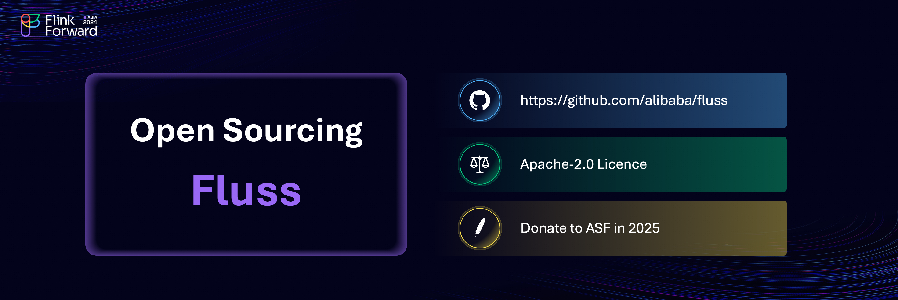
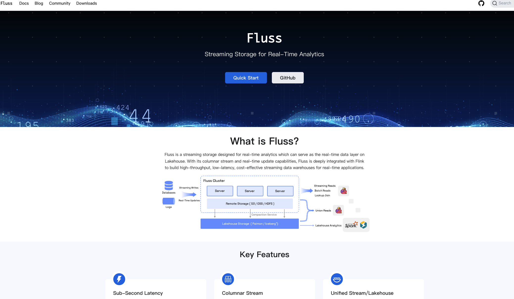

## Fluss Is Now Open Source
Earlier this year at Flink Forward 2024 Berlin we [announced Fluss](https://www.ververica.com/blog/introducing-fluss) and today we are thrilled to announce open-sourcing the project.
Fluss is a **streaming storage system** designed to power real-time analytics. It aspires to change how organizations approach real-time data by acting as the **real-time data layer** for the Lakehouse. 
Its cutting-edge design enables businesses to achieve **sub-second latency**, **high throughput**, and **cost efficiency** for data analytics, making it the ideal solution for modern data-driven applications.

We have historically invested a lot of effort into advancing the data streaming ecosystem, being major contributors to [Apache Flink®](https://flink.apache.org/), [Apache Flink CDC](https://www.ververica.com/blog/ververica-donates-flink-cdc-empowering-real-time-data-integration-for-the-community), and [Apache Paimon](https://paimon.apache.org/).
As part of our commitment, Fluss is now open source under the Apache 2.0 license and is available on [GitHub](https://github.com/alibaba/fluss), inviting users to create the next generation of real-time architectures.

<!-- truncate -->

### Real-Time Streaming Storage for the Lakehouse Era
The need for real-time insights has grown exponentially - especially with the recent explosion of AI. Still, the tools and architectures we’ve relied on for years weren’t designed with streaming-first analytical workflows in mind. Traditional architectures often involve complex integrations between message queues like Kafka, processing engines like Flink, and storage systems that are more batch-oriented than real-time. This approach not only increases latency but also adds operational overhead and cost. Fluss offers a **unified streaming storage layer** purpose-built for **real-time analytics**.

At its core, Fluss combines the best of **streaming** and **analytical storage**. Its **columnar stream** design is optimized for real-time analytical queries, enabling lightning-fast data access and updates. With support for **real-time data ingestion** and integrations with **real-time lakehouse solutions** such as Paimon, Fluss ensures that data is always fresh and ready for analysis, making it ideal for applications where latency is critical.

A critical aspect of Fluss is also its deep integration with Apache FlinkⓇ the de facto gold standard for stream processing. This integration combines a **stream processor** and a **real-time storage layer**, eliminating the need for separate message queues like Kafka in analytics-focused architectures. Fluss simplifies pipelines, reduces costs, and improves performance for **high-throughput**, **low-latency analytics**.

### Building the Future of Analytics with Fluss
Fluss is designed to support a wide range of use cases, from powering dashboards and monitoring systems to enabling **streaming ETL** and **real-time intelligence pipelines** for the modern AI era. Its ability to provide real-time updates makes it a natural fit for **streaming data warehouses**, where fresh data is essential for decision-making.

By serving as the real-time data layer on the Lakehouse, Fluss supports both **streaming-first** architectures and **unified batch and stream processing**. This flexibility should be appealing for organizations looking to modernize their analytics stack while keeping costs low and performance high.

### What’s Next for Fluss?
Open-sourcing Fluss is just the beginning and it will be donated to the Apache Software Foundation (ASF). We’re committed to working closely with the community to expand its capabilities and adoption. You can find more information about the project’s roadmap [here](https://alibaba.github.io/fluss-docs/roadmap/).

### Join the Journey
We invite you to join us and help grow our community around the project. Explore Fluss, contribute to its development, and build the next generation of data pipelines.

Make sure to keep an eye on the project, give it a try and if you like it, don’t forget to give it some ❤️ via ⭐ on [GitHub](https://github.com/alibaba/fluss)

### Getting Started
- Visit the [GitHub repository](https://github.com/alibaba/fluss).
- Check out the [quickstart guide](https://alibaba.github.io/fluss-docs/docs/quickstart/flink/).

### Additional Resources
- Announcement Blog Post: [Introducing Fluss: Unified Streaming Storage For Next-Generation Data Analytics](https://www.ververica.com/blog/introducing-fluss)
- Flink Forward Keynote Announcement: [The Future - Introducing Fluss](https://www.ververica.academy/courses/3d163483-5040-4d60-b5b3-755c3277edf7/activities/1af290fd-05bc-4fab-90be-6ed4628399be)
- Flink Forward Fluss Presentation: [Is Kafka the Best Storage for Streaming Analytics?](https://www.ververica.academy/courses/3d163483-5040-4d60-b5b3-755c3277edf7/activities/a366d118-6c53-47ef-91bb-289fc2462b07)

