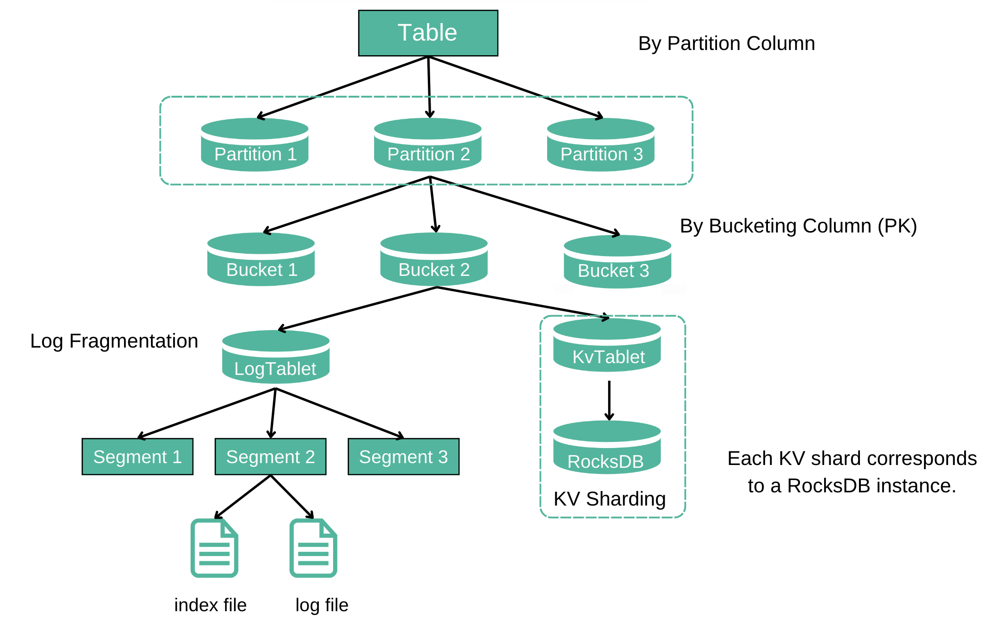

# Storage Model

## Database
A Database is a collection of Table objects. You can create/delete databases or create/modify/delete tables under a database.

## Table
In Fluss, a Table is the fundamental unit of user data storage, organized into rows and columns. Tables are stored within specific databases, adhering to a hierarchical structure (database -> table).

Tables are classified into two types based on the presence of a primary key:
- **Log Tables:**
  - Designed for append-only scenarios. 
  - Support only INSERT operations.
- **PrimaryKey Tables:**
  - Used for updating and managing data in business databases. 
  - Support INSERT, UPDATE, and DELETE operations based on the defined primary key.

A Table becomes a [Partitioned Table](../table-design/data-distribution/partitioning.md) when a partition column is defined. Data with the same partition value is stored in the same partition. Partition columns can be applied to both Log Tables and PrimaryKey Tables, but with specific considerations:
- **For Log Tables**, partitioning is commonly used for log data, typically based on date columns, to facilitate data separation and cleaning.
- **For PrimaryKey Tables**, the partition column must be a subset of the primary key to ensure uniqueness. 

This design ensures efficient data organization, flexibility in handling different use cases, and adherence to data integrity constraints.

## Table Data Organization

### Partition 
A **partition** is a logical division of a table's data into smaller, more manageable subsets based on the values of one or more specified columns, known as partition columns. 
Each unique value (or combination of values) in the partition column(s) defines a distinct partition.

### Bucket
A **bucket** horizontally divides the data of a table/partition into `N` buckets according to the bucketing policy.
The number of buckets `N` can be configured per table. A bucket is the smallest unit of data migration and backup.
The data of a bucket consists of a LogTablet and a (optional) KvTablet.

### LogTablet
A **LogTablet** needs to be generated for each bucket of Log and PrimaryKey tables.
For Log Tables, the LogTablet is both the primary table data and the log data. For PrimaryKey tables, the LogTablet acts
as the log data for the primary table data.
- **Segment:** The smallest unit of log storage in the **LogTablet**. A segment consists of an **.index** file and a **.log** data file.
- **.index:** An `offset sparse index` that stores the mappings between the physical byte address in the message relative offset -> .log file. 
- **.log:** Compact arrangement of log data. 

### KvTablet
Each bucket of the PrimaryKey table needs to generate a KvTablet. Underlying, each KvTablet correspond to an embedded RocksDB instance. RocksDB is a LSM (log structured merge) engine which helps KvTablet supports high-performance updates and lookup query.

