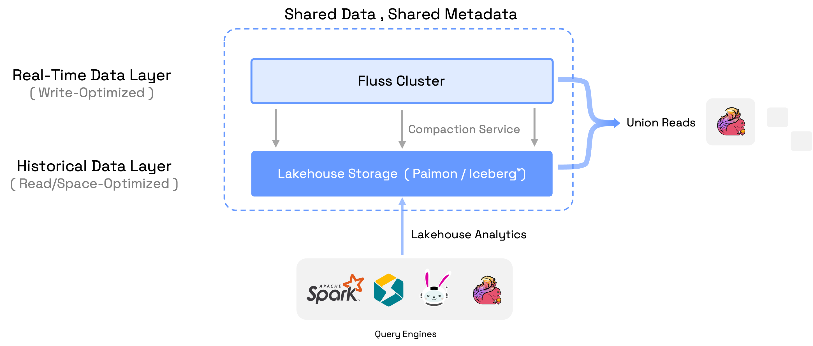

# Lakehouse Overview

## Introducing Lakehouse

Lakehouse represents a new, open architecture that combines the best elements of data lakes and data warehouses. 
It combines data lake scalability and cost-effectiveness with data warehouse reliability and performance. 
The well known data lake format such like [Apache Iceberg](https://iceberg.apache.org/), [Apache Paimon](https://paimon.apache.org/), [Apache Hudi](https://hudi.apache.org/) and [Delta Lake](https://delta.io/) play key roles in the Lakehouse architecture,
facilitating a harmonious balance between data storage, reliability, and analytical capabilities within a single, unified platform.

Lakehouse, as a modern architecture, is effective in addressing the complex needs of data management and analytics.
But they can hardly meet the scenario of real-time analytics requiring sub-second-level data freshness limited by their implementation.
With these data lake formats, you will get into a contradictory situation:

1. If you require low latency, then you write and commit frequently, which means many small Parquet files. This becomes inefficient for
reads which must now deal with masses of small files.
2. If you require read efficiency, then you accumulate data until you can write to large Parquet files, but this introduces
much higher latency.

Overall, these data lake formats typically achieve data freshness at best within minute-level granularity, even under optimal usage conditions.

## Streaming Lakehouse: Streaming & Lakehouse Unification

Fluss is a streaming storage supporting streaming reads and writes with sub-second low latency.
With [Lakehouse Storage](maintenance/tiered-storage/lakehouse-storage.md), Fluss unifies data streaming and data Lakehouse by serving real-time streaming data on top of Lakehouse.
This not only brings low latency to data Lakehouse, but also adds powerful analytics to data streams.

In order to build Streaming Lakehouse, Fluss maintains a compaction service to compact the real-time data in Fluss cluster into Lakehouse storage.
The data in Fluss cluster (streaming Arrow format) is write-optimized for low-latency read and write, and the compacted data in Lakehouse (Parquet format with compressions) is read-optimized for powerful analytics and space-optimized for storing long-term data.
So the data in Fluss cluster serves real-time data layer which retains days with sub-second-level freshness, and the data in Lakehouse serves historical data layer which retains months with minute-level freshness.

The core idea of Streaming Lakehouse is shared data and shared metadata between stream and Lakehouse, avoiding data duplication and metadata inconsistency.
Some powerful features it provided are:

- **Unified Metadata**: Fluss provides a unified table metadata for both data in Stream and Lakehouse. So users only need to handle one table, but can access either the real-time streaming data, or the historical data, or the union of them.
- **Union Reads**: Compute engines perform queries on the table will read the union of the real-time streaming data and Lakehouse data. Currently, only Flink supports union reads, but more engines are on the roadmap.
- **Real-Time Lakehouse**: The union reads help Lakehouse evolving from near-real-time analytics to truly real-time analytics. This empowers businesses to gain more valuable insights from real-time data.
- **Analytical Streams**: The union reads help data streams to have the powerful analytics capabilities. This reduces complexity when developing streaming applications, simplifies debugging, and allows for immediate access to live data insights.
- **Connect to Lakehouse Ecosystem**: Fluss keeps the table metadata in sync with data lake catalogs while compacting data into Lakehouse. This allows external engines like Spark, StarRocks, Flink, Trino to read the data directly by connecting to the data lake catalog.

Currently, Fluss supports [Paimon as Lakehouse Storage](./integrate-data-lakes/paimon.md), more kinds of data lake formats are on the roadmap.